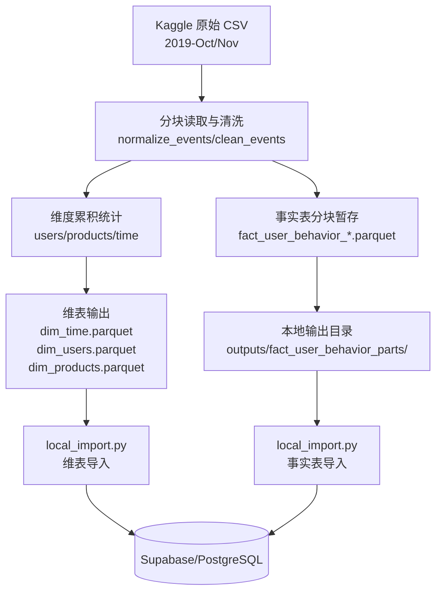

# 项目关键决策与问题记录

本文汇总项目从选栈、建表、Kaggle 处理到 Supabase 导入过程中遇到的问题与原因，便于复盘与后续复用。

## 数据流向/ETL 流程


## 1) 选栈：为什么用 Kaggle 处理 ETL
**原因**
- 数据集体量大（单月 CSV 超 GB 级），本地环境容易爆内存。
- Kaggle Notebook 提供稳定的运行环境与相对充足的资源，适合一次性离线 ETL。
- 方便直接读取 Kaggle 数据集路径，减少数据搬运成本。

**实践结论**
- 适合“离线清洗 + 产出 Parquet”场景，再在本地或云端执行导入。

**解决思路**
- 用托管算力替代本地算力，优先保证“能稳定跑完”。
- 把 ETL 和导入解耦：先产出 Parquet，再做数据库导入。

---
## 2) 选型：为什么选择 Supabase
**原因**
- Supabase 底层为 PostgreSQL，支持标准 SQL、物化视图与常用分析能力。
- 自带 **Supabase Studio**（表结构、SQL 编辑器、便于演示）；**RLS** 与权限与数据仓库安全需求（如 DB-007）方向一致。
- 连接串为标准 Postgres URI：API 侧为 `postgresql+asyncpg://`（asyncpg），导入脚本侧经转换为 `postgresql+psycopg://`（psycopg3），均不绑定专有 API。
- 免费额度可用于演示，可按项目扩容。

**解决思路**
- 选型优先考虑“可视化管理 + 标准 SQL + 低成本演示”。
- 保留 PostgreSQL 生态兼容性；需要时再启用 RLS，而非绑定某一云厂商专有 API。

---
## 3) SQL 创建：为什么建四张表
**原因**
- 采用星型模型：3 张维表 + 1 张事实表。
- 维度表（dim_time、dim_users、dim_products）用于描述维度属性，事实表（fact_user_behavior）记录事件明细。

**收益**
- 便于 OLAP 聚合、按维度切片分析。
- 降低数据冗余，提升查询可读性与一致性。

**解决思路**
- 用星型模型把“事实明细”和“维度属性”拆开，提升聚合效率。
- 事实表承载事件，维表承载解释信息，避免重复字段膨胀。

**建表脚本片段（核心字段）**
```sql
CREATE TABLE dim_time (
  time_key INTEGER PRIMARY KEY,
  date_actual DATE NOT NULL,
  year SMALLINT NOT NULL,
  quarter SMALLINT NOT NULL,
  month SMALLINT NOT NULL,
  week SMALLINT NOT NULL,
  day_of_week SMALLINT NOT NULL,
  is_weekend BOOLEAN NOT NULL,
  is_holiday BOOLEAN DEFAULT FALSE
);

CREATE TABLE dim_users (
  user_key SERIAL PRIMARY KEY,
  user_id INTEGER UNIQUE NOT NULL,
  first_seen_date DATE NOT NULL,
  last_seen_date DATE NOT NULL,
  user_segment VARCHAR(20) DEFAULT 'new',
  region VARCHAR(50) DEFAULT 'unknown',
  device_type VARCHAR(20) DEFAULT 'desktop'
);

CREATE TABLE dim_products (
  product_key SERIAL PRIMARY KEY,
  product_id INTEGER UNIQUE NOT NULL,
  category_id BIGINT NOT NULL,
  category_l1 VARCHAR(50) NOT NULL,
  category_l2 VARCHAR(50) NOT NULL,
  category_l3 VARCHAR(50) DEFAULT 'other',
  brand VARCHAR(50) DEFAULT 'Unknown',
  price_range VARCHAR(20)
);

CREATE TABLE fact_user_behavior (
  event_id BIGSERIAL PRIMARY KEY,
  time_key INTEGER NOT NULL REFERENCES dim_time(time_key),
  user_id INTEGER NOT NULL REFERENCES dim_users(user_id),
  product_id INTEGER NOT NULL REFERENCES dim_products(product_id),
  event_type VARCHAR(20) NOT NULL,
  price DECIMAL(10,2) NOT NULL,
  quantity SMALLINT DEFAULT 1,
  revenue DECIMAL(12,2),
  user_session VARCHAR(50) NOT NULL
);
```

---
## 4) SQL 约束：为什么需要约束
**原因**
- 外键约束确保事实表引用的维度存在，保证数据一致性。
- NOT NULL 约束强制关键字段完整，避免分析偏差。

**注意点**
- 约束会影响导入顺序与截断方式（需先事实后维表或使用 CASCADE）。

**解决思路**
- 在设计期就考虑导入流程，避免运行时被约束阻塞。
- 用外键和 NOT NULL 保证一致性，再通过脚本顺序和 CASCADE 配合落地。

---
## 5) Kaggle Notebook：从全量读取到分块 ETL
**现象**
- 初版 Notebook 全量读取 CSV 时内存溢出，中途被 Kaggle 中断。

**根因分析**
- pandas 全量读取会占用大量内存，且清洗/派生会产生多份副本。
- 事实表构建涉及多维度字段与合并，进一步放大内存峰值。

**核心结论（分块 vs 不分块）**
- 分块与否是“能否跑完 ETL”的本质区别。
- 4244 万行数据在 Kaggle 免费环境中，不分块必然触发 OOM；分块是唯一可行方案。

**对比摘要（不分块 vs 分块）**
- 内存：全量读取需 15–20GB；分块单次约 600MB。
- 结果：不分块崩溃；分块可稳定跑完。
- 逻辑：全量一次性处理；分块逐块处理并及时释放。
- 维表：全量聚合占用高；分块字典增量统计。
- 事实表：全量写入文件过大；分块输出避免超限。
- 耗时：不分块无结果；分块 43 块约 10–15 分钟完成。

**解决方法（分块 ETL 设计）**
  1. **清洗**：类型转换、异常值过滤、空值补齐。
  2. **构建**：
     - 用户统计（首末活跃日期）。
     - 商品统计（价格汇总、计数）。
     - 时间字段（event_date、time_key）。
  3. **写出**：
     - 暂存分块事实表 Parquet 到 `staging/`。
     - 维度统计采用累积字典汇总，避免全量拼接。
  4. **释放内存**：
     - `del` 临时变量 + `gc.collect()`。

**解决思路**
- 将“全量一次性处理”改为“分块流式处理”，把峰值内存拆散到多个小批次。
- 把事实表的重计算压力从内存转移到磁盘（分块 Parquet 输出）。
- 通过逐块累积维度统计，避免在内存里拼接全量结果。

**执行要点（流程对应）**
- 分块读取：用 `chunksize` 循环读取，避免一次性加载全量导致内存瞬间爆满。
- 逐块清洗：标准化字段、过滤脏数据，降低单块占用。
- 增量统计：用字典累计用户/商品维度统计，不存全量明细。
- 分块落地：事实表每块写出 Parquet，避免超大单文件。
- 强制释放：`del` 临时变量 + `gc.collect()`，每块处理完，立即销毁所有临时变量，防止内存堆积。

**事实表分块输出策略**
- 分块生成 `fact_user_behavior_0000.parquet` 等文件，避免单文件过大。
- 在本地导入时按分块文件顺序加载，减少内存压力。

**效果**
- 成功完成 ETL，输出稳定可导入。
- 维表只存汇总后的维度数据，避免全量拼接，最终输出标准星系模型表，对接 Supabase。
- ETL 可扩展到多个月份，且对内存峰值可控。

---
## 6) Supabase（云端 Postgres）导入：问题与解决方法
### 6.1 DATABASE_URL is required
**现象**
- 运行 `python etl/local_import.py --truncate` 报错：
  - `ValueError: DATABASE_URL is required`

**原因**
- 脚本读取环境变量 `DATABASE_URL`，只有 `.env.example` 不会生效。

**解决方法**
- 在脚本中启用 `.env` 自动加载（`load_dotenv()`）。
- 在项目根目录新建 `.env`，写入 `DATABASE_URL=...`

**解决思路**
- 把“环境变量未加载”归因于运行环境，而不是数据库本身。
- 优先让脚本自动读取 `.env`，避免每次手动导出变量。

### 6.2 TRUNCATE 被外键约束阻止
**现象**
- 使用 `--truncate` 时出现：
  - `psycopg2.errors.FeatureNotSupported: cannot truncate a table referenced in a foreign key constraint`

**原因**
- 事实表引用维表，单表截断被外键阻止。

**解决方法**
- 使用单条语句（与当前 `local_import.py` 一致，含 `RESTART IDENTITY`）：
  - `TRUNCATE TABLE fact_user_behavior, dim_users, dim_products, dim_time RESTART IDENTITY CASCADE`

**解决思路**
- 先识别依赖关系（事实表引用维表）。
- 用单条 `TRUNCATE ... CASCADE` 让数据库正确处理依赖顺序。

### 6.3 dim_time.week NOT NULL 约束报错
**现象**
- 插入时报错：
  - `psycopg2.errors.NotNullViolation: null value in column "week" of relation "dim_time" violates not-null constraint`

**原因**
- 导出的 `dim_time.parquet` 中 `week` 列缺失/空值。

**解决方法**
- 导入时兜底计算：
  - `df["week"] = pd.to_datetime(df["date_actual"]).dt.isocalendar().week.astype(int)`

**解决思路**
- 将问题归类为“上游缺失字段”，在导入层做保护性填充。
- 用可重复计算的派生字段（ISO week）修复缺失值。

### 6.4 导入过程缺少进度可视化
**现象**
- 大数据量导入时无法看到整体进度和 ETA。

**解决方法**
- 使用 `tqdm` 增加进度条：
  - 全局总进度条（整体行数）
  - 事实表双层进度条（文件层 + 批次层）
  - 实时显示速度与 ETA

**解决思路**
- 先统计总行数，给出明确的“总量基准”。
- 事实表采用“文件层 + 批次层”双层进度，避免长时间无反馈。

### 6.5 批量插入参数超限 + 日志刷屏
**现象**
- `method="multi"` 批量插入时，单次生成参数过多，触发 PostgreSQL 参数上限。
- 进度条频繁刷新导致日志刷屏。

**原因**
- `chunksize * 列数` 超过 PostgreSQL 最大参数限制（默认 65535）。
- 进度条后缀每次循环都刷新，输出过于密集。

**解决方法**
- 计算安全的 `chunksize`：
  - `safe_chunksize = min(chunksize, max_params // column_count)`
- 进度条刷新节流（例如每 0.5 秒更新一次），并设置 `mininterval`。

**解决思路**
- 把“参数上限”转化为“每次可写行数上限”的计算问题。
- 把“日志刷屏”转化为“刷新频率控制”的 UI 问题。

### 6.6 自然键与代理键错配（增量导入风险）
**现象**
- 增量导入 fact 时出现外键错误或错配。
- 事实表里记录的 `product_key/user_key` 与维表当前代理键不一致。

**原因**
- 事实表使用代理键（自增 `user_key/product_key`）做外键。
- 维表被重建或序列重置后，代理键值发生漂移。
- Parquet 中保存的是“旧的代理键”，不再匹配数据库当前值。

**解决方法（方案 A）**
- 事实表改用自然键外键：`user_id/product_id`。
- 物化视图与索引同步改为自然键。
- ETL 输出 fact 时只保留 `user_id/product_id`，不再写 `user_key/product_key`。

**解决思路**
- 代理键是“数据库内部实现细节”，不适合作为跨批次/跨环境的持久引用。
- 自然键稳定且可复现，适合作为事实表与维表的“长期连接键”。
- 让事实表依赖稳定键，才能保证增量导入可重复、可追溯。

**知识依赖**
- 维度建模：代理键 vs 自然键的语义差异。
- 外键约束：事实表外键必须引用稳定维度键。
- 增量导入策略：增量追加依赖“键稳定性”，否则会错配。
- 数据工程实践：ETL 输出应与数据库主键设计一致。
